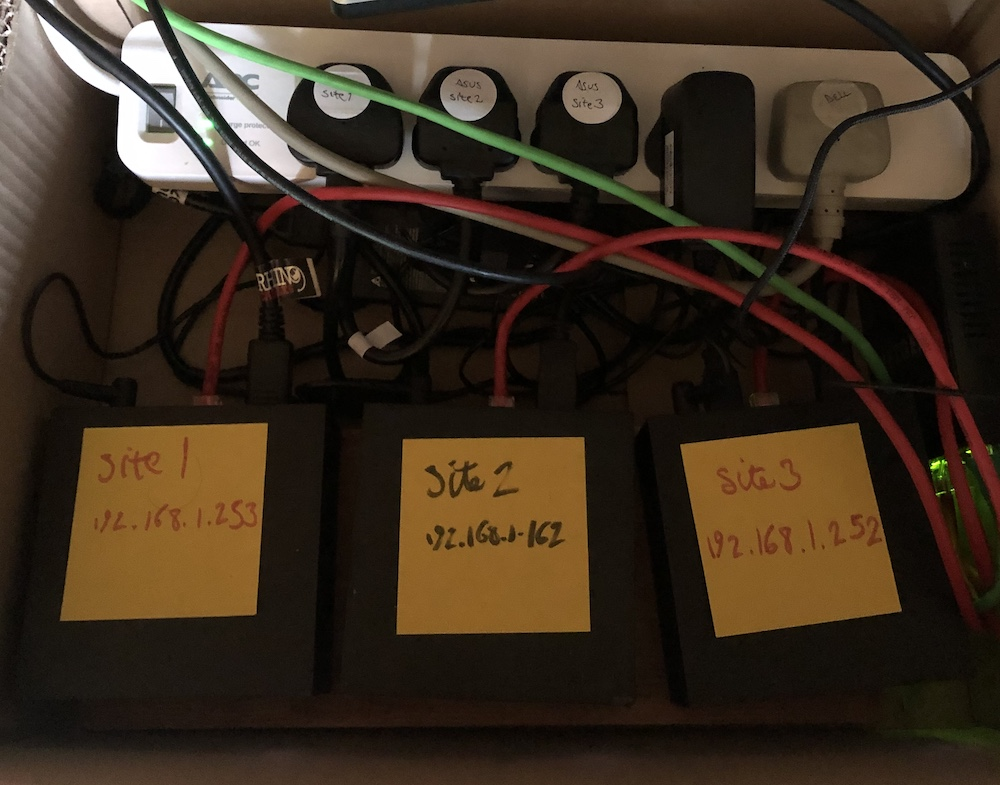

= Ansible playbook for turning a PC into a set of Ansible Automation Platform VMs

!!! this description is mostly outdated pants. 

Ansible helps me build my home lab. 
This playbook turns a PC running RHEL 9 into a hypervisor running a pile-load (that's the technical term) of Virtual Machines. 
Each VM runs a set of services that support my home lab. 

Idea is to build the 
Ansible Automation Platform 2
Reference Architecture. 

https://access.redhat.com/documentation/en-us/reference_architectures/2021/html-single/deploying_ansible_automation_platform_2.1/index#doc-wrapper

Under construction. Sections marked with !!! and ??? are notes to self. 

Ansible helps me build my home lab. 
This playbook turns three PCs into a distributed automation platform.
Each PC runs RHEL 9, a hypervisor, a pile-load (that's the technical term) of Virtual Machines, and many applications.

Architecture is based on the 
https://access.redhat.com/documentation/en-us/reference_architectures/2021/html-single/deploying_ansible_automation_platform_2.1/index#doc-wrapper[Ansible Automation Platform Reference Architecture].

The home lab allows me to emulate a complex IT estate, like you might find in a large organization.

== physical machines

I work from a regular laptop on my home network.
The AAP home lab runs on three PCs.
Each PC emulates a geographical site.

* workstation, my laptop
* site 1, primary AAP cluster
* site 2, secondary AAP cluster
* site 3, supporting services (LDAP, git, DNS, and so on)

== networks

Three networks are involved in making this home lab work.

* home lab
* home network
* Internet

Three PCs provide the physical platform for my home lab, and are connected to my home network. 
The home network is an ordinary domestic network managed by the magic box my ISP provided.
The home network is the collection of router, WiFI antennas, TV, mobile phone and other devices.
The ISP router provides access to the Internet, so this AAP installation can connect to Red Hat's central services.
For instance, RPM packages are downloaded from the Red Hat CDN.
The home lab has its own networks.

Each home lab machine contains two virtual networks. 
One is for public access. This connects to the home lab, and via there to the Internet.
The other network is private, with all the VMs connected to it. 
Access is restricted. 
These VMs can only get to the Internet via a proxy running on the gateway.
I connect to web services on these VMs via a reverse proxy running on the gateway.

== OS (Operating System)

== KVM/QEMU hypervisor 

A bootstrap shell script kicks off the install. 
See instructions in 
https://github.com/nickhardiman/ansible-playbook-lab/blob/main/machine-hypervisor.sh[machine-hypervisor.sh]

== virtual network

* home lab public network
* home lab private network

=== bridges

!!! No point sticking a zero on the end of these. 

.bridges
[%header,format=csv]
|===
name,         libvirt config, networkmanager config, notes
*brpublic0*,    netpublic0,    bridge-public0, public network on every PC
*brsite10*,    netsite10,    bridge-site10, private network on site1 PC
*brsite20*,    netsite20,    bridge-site20, private network on site2 PC
*brsite30*,    netsite30,    bridge-site30, private network on site3 PC
|===

=== MAC addresses

The fourth set of hexadecimal digits is the same as the third octet of the IPv4 address.
eg. All VMs in the domain _site1.example.com_ have MAC addresses starting with 52:54:00:*21* and IPv4 addresses with 192.168.*21*.
The last digits of each host also match. 
eg. controlplane-1.site1.example.com has MAC address 52:54:00:21:00:*10* and IPv4 address 192.168.21.*10*.

* 52:54:00:20:00:00 - public network on the site1 PC
* 52:54:00:21:00:00 - private network on the site1 PC
* 52:54:00:22:00:00 - public network on the site2 PC
* 52:54:00:23:00:00 - private network on the site2 PC
* 52:54:00:24:00:00 - public network on the site3 PC
* 52:54:00:25:00:00 - private network on the site3 PC

=== IPv4 addresses

All addresses are static. 
There are (currently) no DHCP or DNS services.
All host names and addresses are 

Each machine has two networks. 
One is for public access from elsewhere in the network. 
The other is private, for all the VMs.

The third octect matches part of the MAC address (see above).

* 192.168.20.0/24 - public network on the site1 PC
* 192.168.21.0/24 - private network on the site1 PC
* 192.168.22.0/24 - public network on the site2 PC
* 192.168.23.0/24 - private network on the site2 PC
* 192.168.24.0/24 - public network on the site3 PC
* 192.168.25.0/24 - private network on the site3 PC

=== DNS names

Everything is in the _example.com_ domain. 
Addresses on each PC get a site subdomain eg. _controlplane-1.site1.example.com_.

Host names and addresses are stored in /etc/hosts, not in a DNS service. 
This is a pretty poor way of doing things because changes are hard. 
Creating, updating and deleting host names and addresses requires redistributing the /etc/hosts file.
If you want to be flexible, use DNS.

== VMs (guests)

Each VM gets its own __host_vars__ variable file.
More below.

=== site 1, primary AAP cluster

. *gateway*, a proxy with interfaces on the public and private networks. Also provides utilities. !!! move NFS to misc-rhel8?
. *controlplane-1*, a control plane node in the Automation Controller cluster
. *controlplane-2*
. *controlplane-3*
. *database*, a Postgres database for the Automation Controller !!! change to "rdbms", one central postgresql server
. *automationhub-1*, a hub node in the Private Automation Hub cluster. This mounts an NFS share from gateway.
. *automationhub-2*
. *automationhub-3*
. *automationedacontroller*, Event Driven Ansible
. *executionnode-1*, an execution plane node 
. *executionnode-2*
. *misc-rhel8*, RH-SSO and other RHEL 8 applications.

.guests attached to bridges
[%header,format=csv]
|===
name,         interface, MAC,               IP,              domain
*netpublic0*,    *brpublic0*,    52:54:00:03:00:01, 192.168.1.1,     site1.home
gateway,      enp1s0,    52:54:00:03:00:03, 192.168.1.3,     site1.home

*netsite10*,  *brsite10*,   52:54:00:21:00:01, 192.168.21.1,   site1.example.com
 ,           ,           52:54:00:21:00:02, 192.168.21.2,   site1.example.com
gateway,          enp2s0,    52:54:00:21:00:03, 192.168.21.3,   site1.example.com
controlplane-1,   enp1s0,    52:54:00:21:00:10, 192.168.21.10,   site1.example.com
controlplane-2,   enp1s0,    52:54:00:21:00:11, 192.168.21.11,   site1.example.com
controlplane-3,   enp1s0,    52:54:00:21:00:12, 192.168.21.12,   site1.example.com
database,  enp1s0,    52:54:00:21:00:13, 192.168.21.13,   site1.example.com
               ,  enp1s0,    52:54:00:21:00:14, 192.168.21.14,   site1.example.com
executionnode-1,  enp1s0,    52:54:00:21:00:15, 192.168.21.15,   site1.example.com
executionnode-2,  enp1s0,    52:54:00:21:00:16, 192.168.21.16,   site1.example.com
automationhub-1,  enp1s0,    52:54:00:21:00:17, 192.168.21.17,   site1.example.com
automationhub-2,  enp1s0,    52:54:00:21:00:18, 192.168.21.18,   site1.example.com
automationhub-3,  enp1s0,    52:54:00:21:00:19, 192.168.21.19,   site1.example.com
automationedacontroller, enp1s0,    52:54:00:21:00:20, 192.168.21.20,   site1.example.com
misc-rhel8      , enp1s0,    52:54:00:21:00:21, 192.168.21.21,   site1.example.com
|===

== site 2, secondary AAP cluster

A duplicate of site 1.

. *gateway*, a proxy with interfaces on the public and private networks. Also provides utilities.
. *controlplane-1*, a control plane node in the Automation Controller cluster
. *controlplane-2*
. *controlplane-3*
. *database*, a Postgres database for the Automation Controller !!! change to "rdbms", one central postgresql server
. *automationhub-1*, a hub node in the Private Automation Hub cluster. This mounts an NFS share from gateway.
. *automationhub-2*
. *automationhub-3*
. *automationedacontroller*, Even Driven Ansible
. *executionnode-1*, an execution plane node 
. *executionnode-2*
. *misc-rhel8*, RH-SSO and other RHEL 8 applications.

== site 3, supporting services 

LDAP, git, DNS, and so on.

. *gateway*, a proxy with interfaces on the public and private networks. Also provides utilities.
. *satellite* VM provisioning, RPM repos
. *id* Red Hat IDM (LDAP, CA, DNS)
. *message* Postfix
. *monitor* 
. *git* Gitlab
. *secret* Vault
. *dev* toolshed

== variables

Each VM gets its own __host_vars__ variable file, defining name, address and a few other things.
It also inherits a lot of values from __group_vars__ variables files, starting with the 
The https://github.com/nickhardiman/ansible-playbook-aap2-refarch/blob/main/group_vars/all/main.yml["all" variable file]. 

This ansible-inventory command is handy for collecting the many variables for each host in one file.
----
ansible-inventory --inventory ./inventory-site2-single-host.ini  --list --yaml --output ./inventory-site2-single-host.yml
vim ./inventory-site2-single-host.yml
----

== cheatsheet 

AAP install 

manual instructions
 https://access.redhat.com/documentation/en-us/reference_architectures/2021/html-single/deploying_ansible_automation_platform_2.1/index

quite a bit to do 

=== PC and OS

Start with a machine running RHEL 9.
A fresh minimal install is fine.

Only tested on a box with one ethernet interface, plugged into the network.

=== install dependencies

Script
https://raw.githubusercontent.com/nickhardiman/ansible-playbook-lab/main/machine-hypervisor.sh[machine-hypervisor.sh]
sets up everything on a freshly installed host.
This works with RHEL and Fedora.
Some things, like that "dnf install" line, won't work on other OSs.

* Log into the hypervisor machine.
* Download the script.

[source,shell]
....
curl -O https://raw.githubusercontent.com/nickhardiman/ansible-playbook-lab/main/machine-hypervisor.sh 
....

* Read the script and follow the instructions.

The script creates a new user named _ansible_user_
along with a key pair named _ansible-key.priv_ and _ansible-key.pub_
and sudoers privilege escalation.
The playbook uses _ansible_user_ to connect to all the machines,

The script also clones the playbook repo and installs dependencies.

=== add Red Hat Subscription account to the vault

Each new VM will connect to the RHSM (Red Hat Subscription Management) network,
register, attach a subscription entitlement, and download from
Red Hat's CDN (Content Delivery Network).

* Sign up for free at https://developers.redhat.com/.
* Check your account works by logging in at https://access.redhat.com/.
* Edit the vault file.
* Enter your Red Hat Subscription Manager account.
* Encrypt the file.

[source,shell]
....
vim vault-credentials.yml
echo 'my vault password' >  ~/my-vault-pass
ansible-vault encrypt --vault-pass-file ~/my-vault-pass vault-credentials.yml  
....

